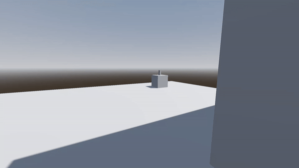

# Creepy can
This is a simple test to replicate the quantum behavior from the video game "Outer Wilds". When you stop looking at an object, either by looking away or being blocked by a wall, it will teleport to a different location.

### Preview

I plan on using this code for a future game that I want to develop. For better quality, download the mp4 file named *"creepy_can_test_1.mp4"* located above.
